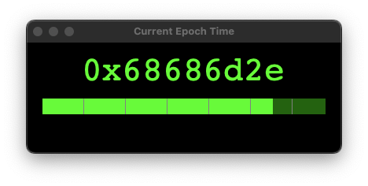

# Epoch Hex Viewer



**Epoch Hex Viewer** is a minimalist GUI app that displays the current Unix epoch time as a hexadecimal value. It visually tracks the 32-bit epoch lifespan with a dynamic progress bar, showing how much time has elapsed and how much remains before the epoch limit (`0x7fffffff`) is reached.

## 🔧 Features

- Live hex display of current Unix epoch time
- Progress bar with:
  - Elapsed time in **lime**
  - Remaining time in **dark green**
- Automatic wraparound after `0x7fffffff` (simulates 32-bit overflow)
- Decade tick marks for time context (1980–2030)
- Built using `tkinter` for lightweight GUI

## 🖥 Requirements

- Python 3.11+ (with Tkinter support)
- macOS recommended (works best with Homebrew Python)

## 🚀 Running the App

```bash
python3 epoch-hex.py